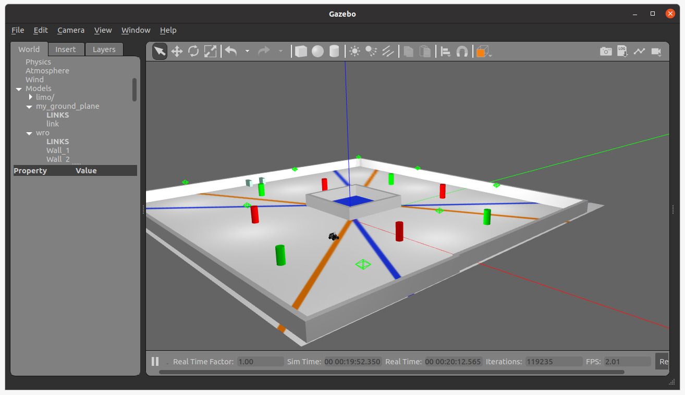
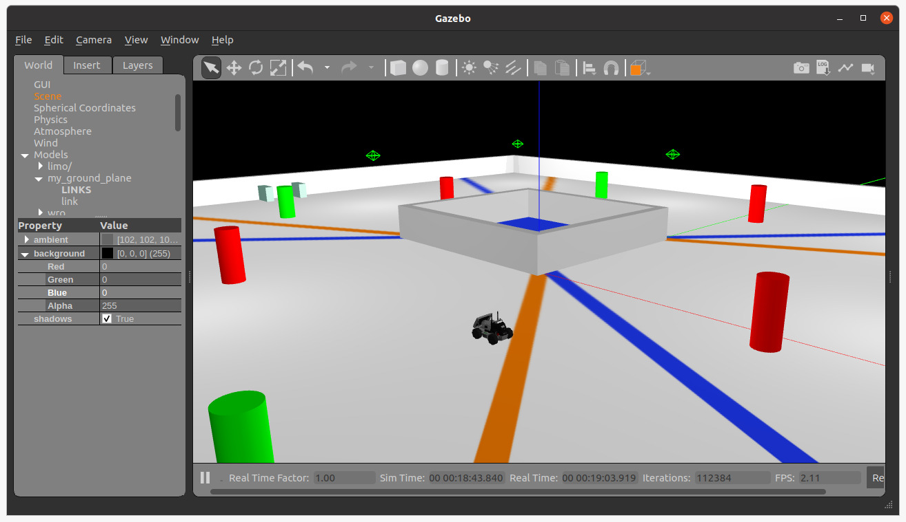

# 🤖 WRO Competition ROS Simulation

A complete **ROS Noetic + Gazebo 11** simulation environment for the **World Robot Olympiad (WRO)**.  
This project replicates the official competition arena and simulates a robot capable of **color-based navigation**, **yaw correction**, and **PID-controlled steering** — just like in the real competition.

The goal: enable a robot to autonomously detect orange and blue lines, perform three smooth 30° turns, and finish aligned at a 90° orientation.

---

## 📸 Demo

### Simulation in Gazebo

  
  

### Robot in Action

  
  

### 🎥 Full Video and demo
👉 [Watch the full demo video](docs/videos/project.mp4)
    [Watch the gif demo video](docs/images/demo.gif)

---

## 🚀 Features
- 🏟️ **Custom Gazebo arena** replicating WRO competition field.  
- 🎥 **Computer vision (OpenCV)** for orange/blue line detection.  
- ⚙️ **PID control** for smooth steering via ESP32 servo.  
- 🧭 **Yaw correction** using IMU for accurate heading.  
- 🔄 **State machine navigation**: 3×30° turns → final 90° alignment.  
- 🔌 ROS integration with hardware-in-the-loop (Jetson + ESP32).  

---

## 🛠️ Tech Stack
- **ROS Noetic**  
- **Gazebo Classic 11**  
- **Python (OpenCV)** for vision  
- **C++** for ROS nodes  
- **ESP32** (servo + motor control)  
- **BNO055 IMU** for orientation  

---

## 📂 Project Structure

wro_competition_ros_simulation/
├── launch/ # Launch files for simulation
├── models/ # Custom Gazebo models
├── src/ # Source code (Python + C++)
├── worlds/ # WRO arena world
├── params/ # Navigation configs (costmaps, planners)
└── docs/
├── images/ # Screenshots + GIF
└── videos/ # Raw demo videos

